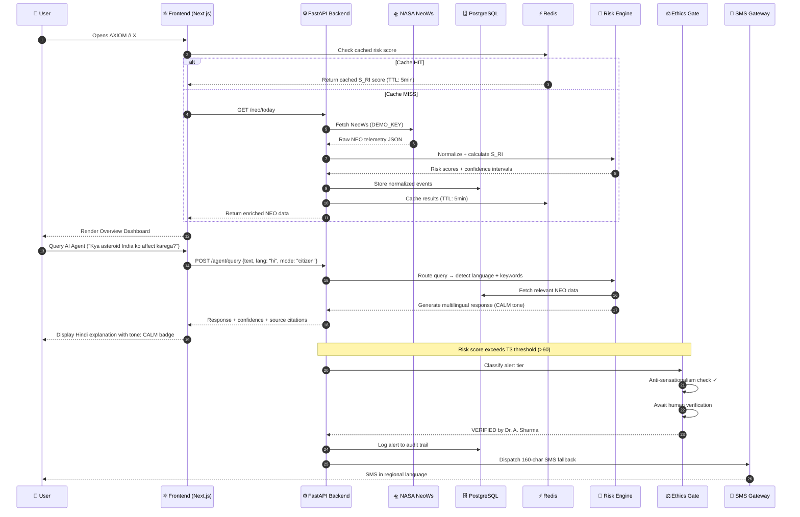

<div align="center">


<br/>

<!-- BADGES ROW 1 -->


<br/>

<!-- BADGES ROW 2 -->


<br/>

<!-- BADGES ROW 3 -->


<br/><br/>

```
 ██████╗ ██╗  ██╗██╗ ██████╗ ███╗   ███╗    ██╗██╗  ██╗
██╔══██╗╚██╗██╔╝██║██╔═══██╗████╗ ████║   ██╔╝╚██╗██╔╝
███████║ ╚███╔╝ ██║██║   ██║██╔████╔██║  ██╔╝  ╚███╔╝ 
██╔══██║ ██╔██╗ ██║██║   ██║██║╚██╔╝██║ ██╔╝   ██╔██╗ 
██║  ██║██╔╝ ██╗██║╚██████╔╝██║ ╚═╝ ██║██╔╝   ██╔╝ ██╗
╚═╝  ╚═╝╚═╝  ╚═╝╚═╝ ╚═════╝ ╚═╝     ╚═╝╚═╝    ╚═╝  ╚═╝
```

### 🌍 A Next-Generation Planetary Risk Operating System
### *Accessible to Citizens · Powerful for Institutions · Ethical by Design*

<br/>

[🚀 Live Demo](https://axiom-x.vercel.app) &nbsp;·&nbsp;
[📖 Documentation](./docs/ARCHITECTURE.md) &nbsp;·&nbsp;
[🐛 Report Bug](https://github.com/your-username/axiom-x/issues) &nbsp;·&nbsp;
[💡 Request Feature](https://github.com/your-username/axiom-x/issues) &nbsp;·&nbsp;
[🤝 Contribute](./CONTRIBUTING.md)

</div>

---

## 📡 What is AXIOM // X?

**AXIOM // X** is a citizen-accessible, edge-first, AI-powered **Planetary Risk Operating System** that transforms complex space and environmental threats — asteroids, solar flares, satellite collisions — into explainable, multilingual, and actionable intelligence in real time.

> It is not a dashboard. It is a **Planetary Risk Operating System.**

```
Data Sources → Ingestion Pipeline → AI Risk Engine → Ethics Gate → Output Modules → Edge Delivery → Citizens
     ↑                                                                                                    |
     └──────────────────────── Feedback Loop (Calibration + FP Monitoring) ─────────────────────────────┘
```

---

## ✨ Key Features

| Feature | Description |
|---|---|
| 🛸 **Real-Time NEO Tracking** | Live NASA JPL telemetry with animated radar sweep |
| 🧠 **Probabilistic Risk Engine** | Bayesian modeling + Monte Carlo (10K simulations/event) |
| 🗣️ **Multilingual AI Agent** | EN · हिंदी · தமிழ் · मराठी — works offline |
| 📱 **Edge-First PWA** | Runs on 2G networks + low-end Android devices |
| 🛰️ **Satellite Collision Monitor** | LEO conjunction alerts feeding into S_RI score |
| 🚨 **Responsible Alert Framework** | Human-verified, anti-sensationalism, tiered T1–T4 |
| 🔬 **Simulation Lab** | Impact calculator + "Defend the Planet" game |
| 📊 **Ethics Dashboard** | FP rate, calibration score, AI audit log |
| 💬 **SMS Fallback** | 160-char multilingual alerts for zero-internet regions |
| ⬡ **S_RI Score (0–100)** | Proprietary risk index: velocity + miss distance + diameter |

---

## 🏗️ System Architecture

```mermaid
graph TB
    subgraph SOURCES ["🌐 Layer 1 — External Data Sources"]
        A1[🛸 NASA NeoWs API<br/>DEMO_KEY · Free]
        A2[🌍 ESA Risk Database<br/>Orbital Parameters]
        A3[☀️ NOAA Solar Monitor<br/>Flares · K-index]
        A4[🛰️ SpaceTrack<br/>Conjunction Alerts]
        A5[🌡️ Climate Feeds<br/>Space Weather]
    end

    subgraph INGEST ["⚙️ Layer 2 — Ingestion Pipeline"]
        B1[API Gateway<br/>FastAPI]
        B2[Event Normalizer<br/>Schema Unification]
        B3[Worker Queue<br/>Redis]
        B4[(PostgreSQL<br/>+ Redis Cache)]
    end

    subgraph ENGINE ["🧠 Layer 3 — Core AI Risk Engine"]
        C1[Bayesian<br/>Threat Model]
        C2[Monte Carlo<br/>10K Simulations]
        C3{{"⬡ S_RI SCORER<br/>0 – 100"}}
        C4[Risk Decay<br/>Model]
        C5[Calibration<br/>Tracker]
    end

    subgraph AI ["🤖 Layer 4 — AI Processing"]
        D1[NLP Explainer<br/>Plain Language]
        D2[AI Agent<br/>4 Modes]
        D3[Multilingual<br/>EN·HI·TA·MR]
        D4[Panic Filter<br/>Tone Guard]
        D5[Edge Model<br/>43MB ONNX]
    end

    subgraph ETHICS ["⚖️ Layer 5 — Ethics & Oversight Gate"]
        E1[Tiered Classifier<br/>T1 → T4]
        E2[Human Verification<br/>T3+ Required]
        E3[Audit Log<br/>Public Transparency]
        E4[Anti-Misinfo<br/>Validator]
    end

    subgraph OUTPUT ["✅ Layer 6 — Output Modules"]
        F1[📡 Radar Center]
        F2[🧠 AI Agent UI]
        F3[🚨 Alert Center]
        F4[🔬 Simulation Lab]
        F5[📊 Metrics Dashboard]
    end

    subgraph EDGE ["📱 Layer 7 — Edge Delivery"]
        G1[☁️ Cloud<br/>Vercel · Railway]
        G2[📱 PWA<br/>2G · Offline]
        G3[🤖 On-Device<br/>ONNX Runtime]
        G4[💬 SMS<br/>Fallback]
    end

    subgraph USERS ["👥 Layer 8 — End Users"]
        H1[👨‍👩‍👧 Citizens]
        H2[🎓 Students]
        H3[🔭 Researchers]
        H4[🏛️ Governments]
        H5[🚒 Emergency]
    end

    A1 & A2 & A3 & A4 & A5 -->|HTTPS Poll| B1
    B1 --> B2 --> B3 --> B4
    B4 -->|Normalized Events| C1 & C2
    C1 & C2 --> C3
    C3 --> C4 & C5
    C3 -->|Risk Score + Context| D1 & D2 & D3 & D4 & D5
    D1 & D2 & D3 & D4 -->|AI Output| E1
    E1 --> E2 --> E3 --> E4
    E4 -->|Verified Output| F1 & F2 & F3 & F4 & F5
    F1 & F2 & F3 & F4 & F5 --> G1 & G2 & G3 & G4
    G1 & G2 & G3 & G4 --> H1 & H2 & H3 & H4 & H5
    H1 & H2 & H3 & H4 & H5 -->|Feedback: FP Reports + Comprehension Scores| C5

    style ENGINE fill:#1a0a2e,stroke:#a855f7,stroke-width:2px
    style ETHICS fill:#1a1200,stroke:#ffbe00,stroke-width:2px
    style SOURCES fill:#001020,stroke:#00d4ff,stroke-width:1px
    style EDGE fill:#200010,stroke:#ff2d55,stroke-width:1px
    style USERS fill:#001020,stroke:#00d4ff,stroke-width:1px
    style C3 fill:#2d1a4a,stroke:#a855f7,stroke-width:3px
```



---

## 🔄 Application Workflow



---

## 🚀 Quick Start

### Prerequisites
```bash
node >= 18.0.0
python >= 3.11
docker & docker-compose
git
```

### 🐳 One Command Setup (Recommended)
```bash
# Clone the repository
git clone https://github.com/your-username/axiom-x.git
cd axiom-x

# Copy environment files
cp axiom-frontend/.env.example axiom-frontend/.env.local
cp axiom-backend/.env.example axiom-backend/.env

# Launch all services
docker-compose up --build
```

| Service | URL |
|---|---|
| 🌐 Frontend | http://localhost:3000 |
| ⚙️ Backend API | http://localhost:8000 |
| 📖 API Docs | http://localhost:8000/docs |
| 🗄️ PostgreSQL | localhost:5432 |
| ⚡ Redis | localhost:6379 |

---

### 🖥️ Manual Setup

**Frontend**
```bash
cd axiom-frontend
npm install
cp .env.example .env.local
# Add NEXT_PUBLIC_NASA_KEY=DEMO_KEY to .env.local
npm run dev
```

**Backend**
```bash
cd axiom-backend
python -m venv venv
source venv/bin/activate        # Windows: venv\Scripts\activate
pip install -r requirements.txt
cp .env.example .env
# Add DATABASE_URL, REDIS_URL, NASA_API_KEY=DEMO_KEY
alembic upgrade head            # Run DB migrations
uvicorn app.main:app --reload
```

---

## 📁 Project Structure

```
axiom-x/
├── axiom-frontend/                 ← Next.js 14 · React · PWA
│   ├── app/                        ← App Router pages
│   │   ├── page.tsx                ← Overview Dashboard
│   │   ├── radar/page.tsx          ← Radar Command Center
│   │   ├── risk-engine/page.tsx    ← Risk Intelligence Engine
│   │   ├── simulation/page.tsx     ← Simulation Lab
│   │   ├── ai-agent/page.tsx       ← AI Agent Chat
│   │   ├── alerts/page.tsx         ← Alert Center
│   │   └── metrics/page.tsx        ← Ethics Dashboard
│   ├── components/                 ← Reusable UI components
│   │   ├── layout/                 ← TopNav, TabNav, BottomBar
│   │   ├── ui/                     ← KPICard, RiskGauge, WorldMap
│   │   ├── radar/                  ← RadarCanvas, TelemetryPanel
│   │   ├── simulation/             ← ImpactCalculator, DefendGame
│   │   └── satellites/             ← ConjunctionPanel
│   ├── hooks/                      ← useNASAData, useRiskScore, etc.
│   ├── lib/                        ← riskCalculator, impactPhysics, etc.
│   ├── styles/                     ← globals.css, animations.css
│   └── public/                     ← manifest.json, sw.js, edge-model.onnx
│
├── axiom-backend/                  ← FastAPI · Python · PostgreSQL
│   ├── app/
│   │   ├── main.py                 ← FastAPI entry point
│   │   ├── routers/                ← neo, risk, alerts, satellites, metrics
│   │   ├── services/               ← risk_engine, alert_engine, nlp_explainer
│   │   ├── models/                 ← SQLAlchemy schemas
│   │   ├── db/                     ← database.py, redis_client.py
│   │   └── workers/                ← ingest_worker, alert_worker
│   └── tests/                      ← pytest test suite
│
├── docs/                           ← Architecture, API, Responsible AI docs
├── .github/workflows/              ← CI/CD pipelines
├── docker-compose.yml              ← One-command full stack
└── README.md
```

---

## 🧠 S_RI Risk Score Formula

```
S_RI = (velocity / 30) × 40  +  (1 / missDistance) × 40  +  (diameter × 1000) × 20
```

| Factor | Weight | Source |
|---|---|---|
| Approach Velocity (km/s) | 40% | NASA NeoWs |
| Miss Distance (Lunar Distances) | 40% | NASA NeoWs |
| Estimated Diameter (km) | 20% | NASA NeoWs |

| Score Range | Classification | Action |
|---|---|---|
| 0 – 20 | 🟢 NEGLIGIBLE | Stand Down |
| 21 – 40 | 🟡 WATCH | Passive Monitoring |
| 41 – 60 | 🟠 WARNING | Active Monitoring |
| 61 – 100 | 🔴 CRITICAL | Human Verification Required |

---

## 🌐 API Reference

```bash
# Risk & NEO
GET  /neo/today                    # Today's NASA NEO data
GET  /neo/{id}                     # Single NEO details
POST /risk/score                   # Calculate S_RI score
GET  /risk/history                 # 24h risk timeline

# Alerts
GET  /alerts                       # Active tiered alerts
POST /alerts/verify                # Human verification endpoint

# Satellites
GET  /satellites/conjunctions      # Active conjunction warnings

# Solar
GET  /solar/flares                 # NOAA solar flare data

# Metrics
GET  /metrics                      # FP rate, calibration, latency stats
```

Full interactive API docs available at `/docs` (Swagger UI) when running locally.

---

## ⚖️ Responsible AI

AXIOM // X is **ethical by design**, not as an afterthought.

```
┌─────────────────────────────────────────────────────────────┐
│                  ETHICS GATE (Layer 5)                      │
│                                                             │
│  ✅ Human verification required for all T3+ alerts          │
│  ✅ Anti-sensationalism filter on every AI output           │
│  ✅ Calm language enforcement — no fear amplification       │
│  ✅ Full public audit log of every AI decision              │
│  ✅ False positive rate monitored — auto-recalibrate >10%   │
│  ✅ Uncertainty always disclosed to users                   │
│  ✅ No T4 Critical alert without dual human sign-off        │
└─────────────────────────────────────────────────────────────┘
```

See [RESPONSIBLE_AI.md](./docs/RESPONSIBLE_AI.md) for full ethics documentation.

---

## 🔴 AMD Slingshot Integration

```
AMD Ryzen AI NPU  ──►  Runs 43MB ONNX model on-device (340ms, offline)
AMD EPYC Server   ──►  Powers Monte Carlo 10K simulations in cloud
AMD ROCm + HIP    ──►  GPU-accelerates NumPy/SciPy risk calculations
AMD INT8 Quant    ──►  Compresses 2.1GB model → 43MB for edge devices
```

AXIOM // X embodies AMD Slingshot's vision: **Pervasive AI for everyone, everywhere.**

---

## 💰 Free Hosting Stack

| Service | Provider | Cost |
|---|---|---|
| Frontend | Vercel Free Tier | ₹0 |
| Backend | Railway Free Tier | ₹0 |
| PostgreSQL | Supabase Free Tier | ₹0 |
| Redis | Upstash Free Tier | ₹0 |
| NASA API | DEMO_KEY (built-in) | ₹0 |
| **Total** | | **₹0** |

---

## 📊 Impact Metrics

<div align="center">

| Metric | Value |
|:---|:---:|
| 🌍 Edge Nodes | **847** across 23 countries |
| 🗣️ Languages Offline | **4** (EN · हिं · தமி · मरा) |
| ⚡ On-Device Inference | **340ms** average |
| 📱 Low-BW Users Served | **89,432** |
| 📚 Literacy Improvement | **+31%** |
| 🛡️ False Positive Rate | **< 4.2%** |
| ⏱️ Alert Latency | **< 2.3s** |
| ✅ Model Calibration | **0.91** Brier score |

</div>

---

## 🛠️ Tech Stack

<div align="center">


</div>

---

## 🤝 Contributing

Contributions are welcome! Please read [CONTRIBUTING.md](./CONTRIBUTING.md) first.

```bash
# Fork the repo
# Create your feature branch
git checkout -b feature/AmazingFeature

# Commit your changes
git commit -m 'feat: Add AmazingFeature'

# Push to the branch
git push origin feature/AmazingFeature

# Open a Pull Request
```

---

## 📄 License

Distributed under the MIT License. See [LICENSE](./LICENSE) for more information.

---

## 👤 Author

**Supriya**
> Building planetary intelligence for the next generation.

[](https://github.com/supriya-cybertech)
)
[](https://www.linkedin.com/in/supriya-kumari15/)
)
[](https://twitter.com/exotic-supriya)

---

<div align="center">


**⭐ Star this repo if AXIOM // X inspires you to look up at the sky differently.**

`UPLINK ACTIVE — AXIOM PLANETARY DEFENSE NETWORK`


&nbsp;

&nbsp;


</div>
